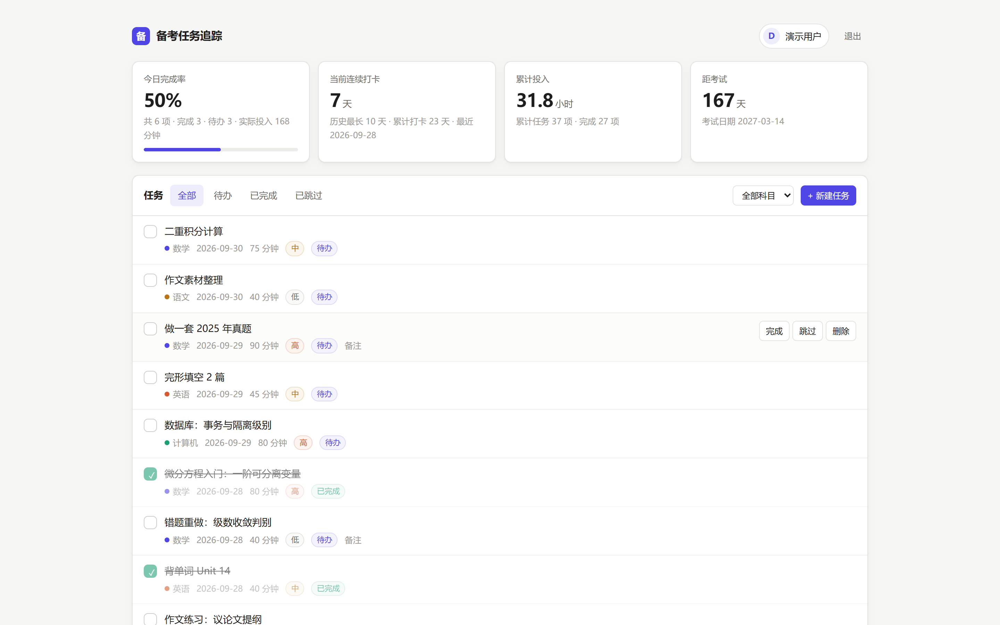
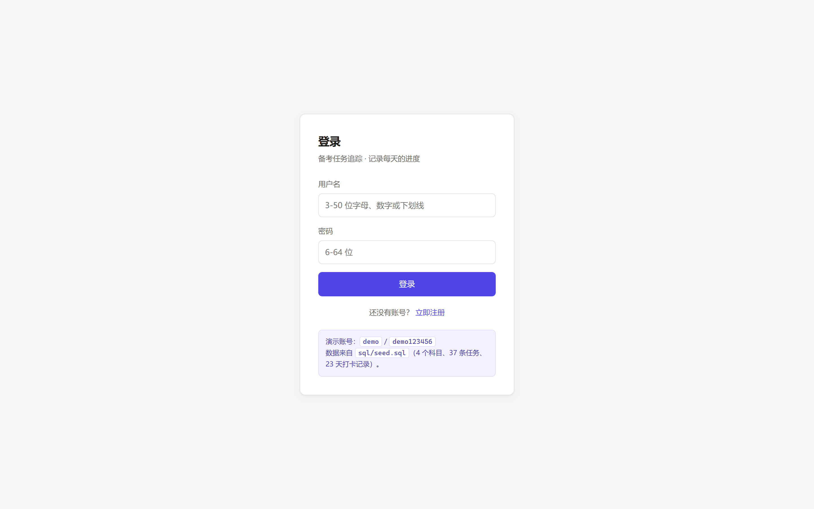
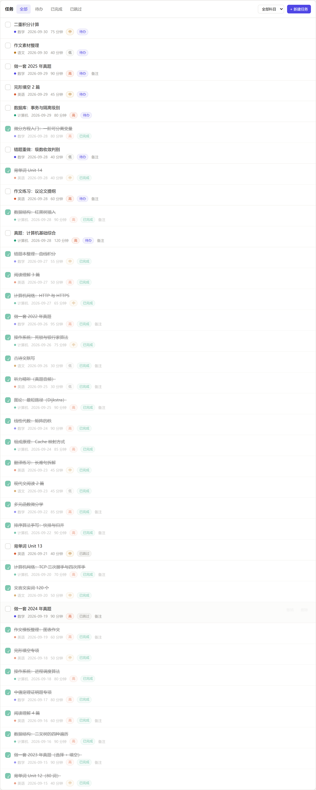
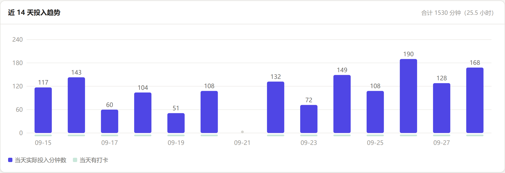
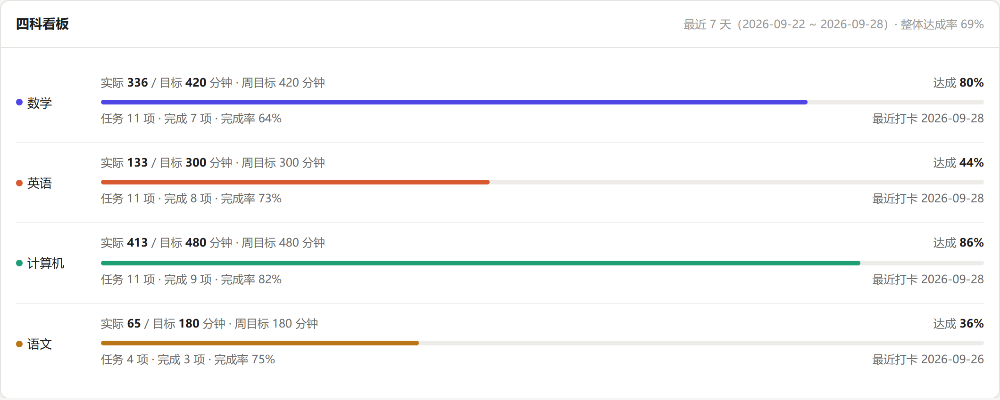
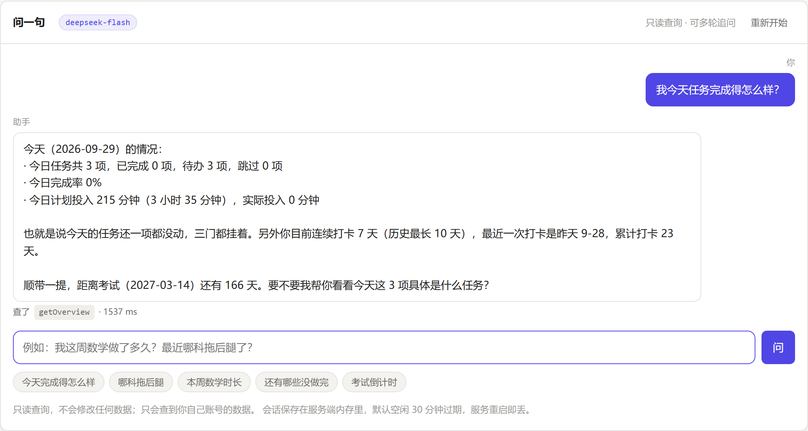
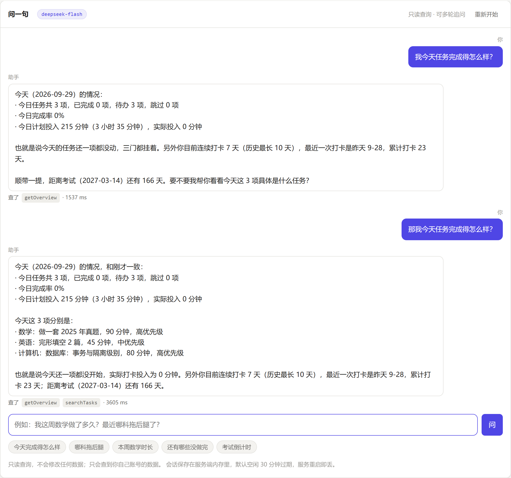

# exam-tracker · 备考任务追踪

> 面向备考者的**学习管理系统**：科目 → 每日任务 → 学习打卡 → 进度统计，一条闭环。
> 用 Spring Boot 3.5 / Java 17 从零手写后端，**外加一个零依赖零构建的静态前端** ——
> `./run.cmd` 一条命令起服务，浏览器打开就是能点的界面，不用配任何东西。
> 还有一个**可选的 AI 助手**：用一句中文问「我这周数学做了多久」，它自己去查库再回答
> （基于 Spring AI + DeepSeek，**默认关闭**，不配也能把整个项目跑起来）。

<p>


</p>

**演示账号：`demo` / `demo123456`** —— 登录后看到的是 `sql/seed.sql` 灌入的 4 个科目、
37 条任务、23 天打卡记录（相对今天计算，所以演示数据不会过期）。

<p align="center">
  
</p>

---

## 日本語

exam-tracker は、資格試験の受験者向けの**学習管理システム**です。科目・日次タスク・
学習チェックイン・進捗統計を提供します。バックエンドは Spring Boot 3.5 / Java 17 で
一から実装し、**依存ゼロ・ビルド不要の静的フロントエンド**を同梱しています。

- **技術スタック**：Java 17 / Spring Boot 3.5 / Spring Security + JWT / Spring Data JPA / MySQL 8 / Springdoc OpenAPI / Spring AI 1.1.8（任意）
- **設計方針**：すべてのクエリに `user_id` 条件を含めることで、ID を推測されても他人のデータに到達できないようにしています（IDOR 対策）
- **AI アシスタント（任意・デフォルト無効）**：自然言語で自分の学習データを照会できます。**AI が SQL を書くのではなく、あらかじめ用意した 5 つの読み取り専用ツールを呼びます**。ユーザー ID はサーバー側で `ToolContext` 経由で注入され、モデルには一切渡りません
- **品質**：単体テスト **309 件**、統合テスト **35 件**（実 MySQL + 実 HTTP、`mvn verify` に組み込み済み）、E2E 検証 **86 項目**、AI E2E 検証 **31 項目**、Web 契約検証 **82 項目**、描画セルフチェック **23 項目**をすべてパス（実測ログを本 README に掲載）
- **同梱物**：ブラウザ UI、Swagger UI（`/api/doc.html`）、建表 SQL（`sql/schema.sql`）、デモデータ（`sql/seed.sql`）、Dockerfile、docker-compose.yml

## English

exam-tracker is a **study-management system** for exam candidates: subjects, daily
tasks, study check-ins and progress statistics. The backend is written from scratch in
Spring Boot 3.5 / Java 17, and ships with a **zero-dependency, zero-build static frontend**.
It also has an **optional AI assistant** (Spring AI + DeepSeek, **off by default**) that
answers natural-language questions about your own study data.

- **Stack**: Java 17, Spring Boot 3.5, Spring Security + JWT, Spring Data JPA, MySQL 8, Springdoc OpenAPI, Spring AI 1.1.8 (optional)
- **Design**: every query is scoped by `user_id`, so guessing an ID never reaches another user's data (IDOR defence)
- **AI design**: the model **does not write SQL**. It calls 5 pre-registered read-only tools; the user id is injected server-side through `ToolContext` and never reaches the model
- **Quality**: **309 unit tests**, **35 integration tests** (real MySQL + real HTTP, wired into `mvn verify`), **86 end-to-end assertions**, **31 AI end-to-end assertions**, **82 web-contract assertions** and **23 render self-checks**, all passing (measured output included below)
- **Ships with**: a browser UI, Swagger UI at `/api/doc.html`, DDL in `sql/schema.sql`, demo data in `sql/seed.sql`, Dockerfile, docker-compose.yml

---

## 1. 它解决什么问题

备考的人真正需要的不是「待办清单」，而是回答四个问题：

| 问题 | 本项目的回答 |
|---|---|
| 今天该做什么？ | 每日任务（科目 / 计划日期 / 计划时长 / 优先级） |
| 我到底学了多久？ | 学习打卡（**实际**投入分钟数，可与任务无关） |
| 我是在进步还是在自我感动？ | 四科看板（窗口内达成率）、连续打卡天数、考试倒计时 |
| 这些数字我不想一页页翻，能不能直接问？ | **AI 助手**：一句中文问「我这周数学做了多久」，它去查库再回答（可选，见第 7.5 节） |

关键点是**「计划」和「实际」是两个字段**。只记「任务完成没」会丢掉「计划 90 分钟、实际只学了 20 分钟」
这类信息 —— 而备考里这恰恰是最需要看见的。

AI 助手是**加在第 1~3 问之上的一层**，不是替代：所有统计口径都还是原来那套接口算的，
AI 只负责「把你的话翻译成调哪个接口、再把人话组织回来」。它读不到任何新数据，
也改不了任何数据。

---

## 2. 界面

界面是**三个静态文件**（`index.html` + `app.js` + `style.css`，共 1,657 行），
由 Spring Boot 直接从 jar 里托管 —— **没有 Node、没有 npm、没有构建步骤、没有 CDN**。

这不是为了炫技，是为了**能跑**：演示时经常没有稳定网络，用 CDN 图表库的话断网就是一片空白。
所以连趋势图都是手写 SVG 画的（`renderTrend()`，约 60 行），不引任何图表库。

### 2.1 登录

<p align="center">
  
</p>

演示账号直接印在页面上（`demo` / `demo123456`），不用去翻文档找。

### 2.2 仪表盘

<p align="center">
  
</p>

四个卡片回答四个问题：**今天完成了多少 / 连续打卡几天 / 一共投入多久 / 距考试还有几天**。

第二张卡片的副标题里藏着对比信息 ——「历史最长 10 天 · 累计打卡 23 天」。
当前 7 天、历史最长 10 天，差的那 3 天说明中间断过签。**这个对比是刻意留出来的**：
种子数据里 D-7 那天只有「跳过」没有打卡，否则「历史最长」这个指标永远等于当前值，没有意义。

### 2.3 任务列表

<p align="center">
  
</p>

每行是：复选框 · 标题 · **科目色点** · 计划日期 · 计划分钟 · 优先级 · 状态 · 备注。
状态 tab 和科目下拉可以组合筛选（服务端筛选，不是前端过滤）。

### 2.4 近 14 天投入趋势

<p align="center">
  
</p>

手写 SVG。两个细节：

- **没打卡的那天画一个灰色小点**（图里的 09-21），而不是什么都不画 ——
  否则柱子之间空一格，看起来像渲染失败而不是「那天没学」。
- 后端只返回**有打卡的日期**，前端要补 0 成完整 14 天，不然不连续的日子会被画成连续的。

### 2.5 四科看板

<p align="center">
  
</p>

每个科目一行：窗口内**实际 / 目标**分钟、达成率、任务完成率、最近打卡日。
颜色和任务列表里的科目色点是同一套（存在 `subject.color` 里），所以两处天然一致。

看板回答的是第 1 节那个问题 ——「**我是在进步还是在自我感动？**」
比如图里英语 133 / 300 分钟（44%）而计算机 413 / 480（86%），偏科一眼可见。

### 2.6 AI 助手（可选）

<p align="center">
  
</p>

面板在仪表盘上方，只有一个输入框加 5 个示例问题。**没配 key 的时候不显示输入框**，
而是显示一块「怎么开启」的说明 —— 让人看到的是一个能照做的配置步骤，
而不是一个点了会报错的框。

答案下面那行小字是本轮**实际调用的工具名和耗时**。这不只是调试信息：
它让「AI 到底查了什么」变得可见，用户能自己判断这个答案是不是基于他以为的那份数据。

<p align="center">
  
</p>

支持多轮追问（「那英语呢？」），模型会沿用上一轮的时间范围。会话存在服务端内存里，
空闲 30 分钟过期，**服务重启即丢** —— 这是刻意的取舍，见第 7.5 节。

---

## 3. 技术栈

| 层 | 选型 | 说明 |
|---|---|---|
| 语言 / 运行时 | Java 17（LTS） | 用 `record`、文本块、`switch` 表达式 |
| 框架 | Spring Boot **3.5.14** | Web / Validation / Actuator |
| 持久化 | Spring Data JPA + Hibernate | 复杂筛选走 `Specification` |
| 数据库 | MySQL **8.0** | 表结构由 `sql/schema.sql` 管理，应用侧 `ddl-auto: validate` |
| 安全 | Spring Security + **jjwt 0.12.6** | 无状态 JWT，BCrypt 存密码 |
| 文档 | Springdoc OpenAPI **2.8.17** | Swagger UI：`/api/doc.html` |
| 前端 | **原生 HTML + CSS + ES5 JavaScript** | 3 个文件 / 1,657 行，零依赖零构建 |
| AI（可选） | **Spring AI 1.1.8** + DeepSeek | 只做「自然语言 → 调已有接口」，**不让模型写 SQL**；默认关闭，见第 7.5 节 |
| 测试（单元） | JUnit 5 + Mockito + AssertJ + MockMvc | `mvn test` · **surefire** · 309 个用例，纯 Mockito 不启动容器 |
| 测试（集成） | JUnit 5 + 真实 MySQL + 真实 HTTP | `mvn verify` · **failsafe** · 35 个用例，启动完整 Spring 容器 |
| 构建 | Maven（`./mvnw`，无需预装） | 打包出可执行 fat jar |
| CI | GitHub Actions | `mvn verify` + MySQL 8 service，每次 push / PR 自动跑 |

规模：**60 个主源文件 / 5,206 行**，**23 个测试文件 / 6,243 行**（测试比主代码还多 20%），
**3 个前端文件 / 1,657 行**。

---

## 4. 快速开始

### 4.1 一条命令（推荐）

Windows —— 双击 `run.cmd`，或在终端里：

```cmd
run.cmd
```

Linux / macOS：

```bash
./run.sh
```

两个脚本逻辑一致，会依次：检查 Java → 找（或构建）jar → 探测 MySQL 端口 →
按需建库并灌入演示数据 → 启动。每一步都打印在做什么，**失败会明确告诉你卡在哪一步**，
不会静默跳过。

| 参数 | 作用 |
|---|---|
| （无） | 有 jar 就直接用；没有才构建。数据库不可达时会问你要不要建 |
| `init` | 建库 + 灌 `sql/seed.sql` 演示数据，然后退出（不启动） |
| `skip` | 跳过所有数据库检查，直接用现有 jar 启动（改代码时最快） |

启动后终端会打印：

```
Starting exam-tracker ...

  Web UI  : http://127.0.0.1:8090/api/
  API doc : http://127.0.0.1:8090/api/doc.html
  Login   : demo / demo123456

  Press Ctrl+C to stop.
```

**打开 <http://127.0.0.1:8090/api/> 就是第 2 节那个界面**，用 `demo` / `demo123456` 登录。

> `run.cmd` 是**纯 ASCII** 的，这不是洁癖：`cmd.exe` 用 OEM 代码页（中文 Windows 是 GBK）
> 读 `.cmd` 文件，UTF-8 中文注释会被错误解码，乱码字节可能从 `REM` 行里漏出来被当成命令执行 ——
> 结果是**启动其实成功了，但屏幕上蹦出「不是内部或外部命令」**，让人去找一个根本不存在的 bug。
> 所以里面只有英文注释，文件末尾也是 CRLF 而不是 LF。

### 4.2 手动三步

```bash
# 1) 建库建表（幂等，可重复执行）
mysql -h 127.0.0.1 -P 3308 -uroot -p < sql/schema.sql

# 1b) 灌演示数据（可选，但强烈建议 —— 空库打开界面什么都看不到）
mysql -h 127.0.0.1 -P 3308 -uroot -p exam_tracker < sql/seed.sql

# 2) 打包（会先跑 309 个单元测试）
./mvnw package

# 2b) 想连集成测试一起跑（需要一个真实可连的 MySQL，见 8.2）
./mvnw verify

# 3) 启动
java -jar target/exam-tracker-1.0.0.jar
```

启动日志（实测）：

```
Tomcat started on port 8090 (http) with context path '/api'
Started ExamTrackerApplication in 6.391 seconds (process running for 6.848)
```

验证：

```bash
curl --noproxy '*' http://127.0.0.1:8090/api/health
# {"status":"ok"}
```

> `--noproxy '*'` 不是多余的：本机开发环境有系统代理，它会把 `127.0.0.1` 的请求也劫持走，
> 表现为 curl 超时 —— 看起来像服务没起来，其实起来了。

### 4.3 演示数据（`sql/seed.sql`）

`demo` 账号看到的所有内容都来自这个脚本。它有两个设计要点：

**① 用 `CURDATE()` 相对计算，不写死日期。** 写死「2026-09-28」的话，
过几天再演示，界面上全是「过期任务」，「今日完成率」也永远是 0。所以种子数据全部相对今天生成。

**② 幂等，可以反复灌。** 靠的是 `app_user` 上的 `ON DELETE CASCADE`：
先删 `demo` 用户，级联带走他的科目 / 任务 / 打卡，再重新插入。

这里踩过一个坑：最初用 `MOD(t.id, 5)` 当「实际时长」的扰动系数，结果**重灌后数字会漂**
（1916 → 1912 → 1921）—— 因为 `id` 是自增的，重灌之后整体后移了。改成
`MOD(DAYOFYEAR(plan_date) + plan_minutes, 5)` 之后，连跑三次都是同一个数字。

灌完后的自检输出（连跑三次完全一致）：

| 指标 | 值 |
|---|---:|
| 科目数 | 4 |
| 任务总数 | 37 |
| 已完成 | 27 |
| 打卡记录 | 37 |
| 打卡天数 | 23 |
| 累计投入分钟 | 1905 |
| 当前连续打卡 | 7 天 |
| 历史最长连续 | 10 天 |

**当前 7 天 / 历史最长 10 天不是巧合**：种子数据里 D-7 那天只标了「跳过」没有打卡，
刻意留出一个断签，否则「历史最长」永远等于当前值，这个指标就没有对比意义了。
更早的打卡里也留了 D-15 / D-14 两天空档。

### 4.4 全部可覆盖的环境变量

| 变量 | 默认值 | 用途 |
|---|---|---|
| `SERVER_PORT` | `8090` | 端口 |
| `SERVER_ADDRESS` | `127.0.0.1` | 监听地址。**默认只绑回环**；Docker 里必须设成 `0.0.0.0` |
| `DB_HOST` / `DB_PORT` | `127.0.0.1` / `3308` | 数据库地址 |
| `DB_NAME` | `exam_tracker` | 库名 |
| `DB_USERNAME` / `DB_PASSWORD` | `dev` / `dev123456` | 数据库账号 |
| `JWT_SECRET` | 开发用默认值（64 字节） | **生产必须覆盖**：`openssl rand -base64 48` |
| `JWT_EXPIRE_MINUTES` | `720` | token 有效期（分钟） |
| `CORS_ALLOWED_ORIGINS` | `http://localhost:5173,http://localhost:3000` | 逗号分隔 |
| `LOG_LEVEL` | `INFO` | 应用日志级别 |
| `DB_POOL_SIZE` | `10` | Hikari 连接池上限 |

AI 层（**全部可选**，不设也能正常跑）：

| 变量 | 默认值 | 用途 |
|---|---|---|
| `AI_ENABLED` | `false` | 是否启用 AI 助手。**必须显式设成 `true`** |
| `DEEPSEEK_API_KEY` | 空 | API key。**只能来自环境变量，绝不写进仓库**（见 7.5.6） |
| `AI_BASE_URL` | `https://api.deepseek.com` | OpenAI 兼容端点 |
| `AI_MODEL` | `deepseek-flash` | 模型名 |
| `AI_TIMEOUT` | `45s` | 单次请求超时。这个值是**实测调出来的**，见 7.5.5 |
| `AI_TEMPERATURE` | `0.0` | 查数据要稳定复现，不要文采 |
| `AI_MAX_HISTORY_MESSAGES` | `20` | 多轮对话保留的最大消息条数 |
| `AI_SESSION_TTL` | `30m` | 会话空闲多久过期（内存态，重启即丢） |

> ⚠️ 有一个坑：**环境变量优先级低于命令行参数，但高于 `application.yml` 里的默认值**。
> 如果 shell 里已经存在一个 `SERVER_PORT`（或 Spring 的 `SERVER__PORT`），它会覆盖 yml，
> 应用就跑到别的端口上去了。排查时用 `--server.port=8090` 显式指定，命令行参数优先级最高。

### 4.5 Docker

```bash
docker compose up -d --build
curl --noproxy '*' http://127.0.0.1:8090/api/health
```

compose 会另起一个 MySQL（映射到宿主机的 **13308**，不和工作区的 3308 撞），
并自动执行 `sql/schema.sql`。

> ⚠️ **诚实声明**：`Dockerfile` 与 `docker-compose.yml` **没有在真实 Docker 上构建验证过** ——
> 开发机的 Docker 起不来（`hypervisorlaunchtype=Off`，见工作区 `docs/runtime.md`）。
> 文件内容是按官方文档写的，但「能跑」请以你自己 `docker compose up` 的结果为准。
> 本 README 里所有「实测」字样指的都是 **4.1 / 4.2 的本地 jar 路线**。

---

## 5. API 一览

统一前缀 `/api`（`server.servlet.context-path`），**16 个路径 / 24 个操作**。

所有响应都是同一个外壳（`/health` 除外，它刻意返回裸 JSON）：

```json
{ "code": 0, "message": "成功", "data": { } }
```

`code` 为业务码：`0` 成功，`4xxxx` 客户端问题，`5xxxx` 服务端问题 —— **前三位对齐 HTTP 状态码**。

### 认证 `/auth`

| 方法 | 路径 | 说明 | 认证 |
|---|---|---|---|
| POST | `/auth/register` | 注册（用户名全局唯一，BCrypt 存密码） | 公开 |
| POST | `/auth/login` | 登录，返回 JWT | 公开 |
| GET | `/auth/me` | 当前用户信息 | ✅ |
| PATCH | `/auth/me` | 修改昵称 / 考试日期（全量替换语义） | ✅ |

### 科目 `/subjects`

| 方法 | 路径 | 说明 |
|---|---|---|
| GET | `/subjects` | 科目列表（按 `sortOrder`） |
| GET | `/subjects/{id}` | 详情 |
| POST | `/subjects` | 新建（同一用户下不可重名） |
| PUT | `/subjects/{id}` | 修改 |
| DELETE | `/subjects/{id}?force=` | 删除。**默认拒绝**有数据的科目（409），`force=true` 才级联 |

### 任务 `/tasks`

| 方法 | 路径 | 说明 |
|---|---|---|
| GET | `/tasks` | 分页 + 筛选（`from` / `to` / `subjectId` / `status` / `priority` / `keyword` / `sortBy` / `direction`） |
| GET | `/tasks/{id}` | 详情 |
| POST | `/tasks` | 新建 |
| PUT | `/tasks/{id}` | 修改（不含状态） |
| PATCH | `/tasks/{id}/status` | 变更状态（`TODO` / `DONE` / `SKIPPED`） |
| DELETE | `/tasks/{id}` | 删除（**不删打卡记录**） |

### 打卡 `/checkins`

| 方法 | 路径 | 说明 |
|---|---|---|
| POST | `/checkins` | 新增。`subjectId` 与 `taskId` 二选一，传了 `taskId` 则以任务为准 |
| GET | `/checkins` | 列表。不传日期时**默认只回溯 30 天** |
| GET | `/checkins/daily` | 按天汇总（日历视图） |
| DELETE | `/checkins/{id}` | 删除 |

### 统计 `/stats`

| 方法 | 路径 | 说明 |
|---|---|---|
| GET | `/stats/overview` | 仪表盘：今日任务 / 连续打卡 / 累计时长 / 考试倒计时 |
| GET | `/stats/subjects?days=` | 四科看板：窗口内达成率（`days` 上限 365，默认 7） |

### AI 助手 `/ai`（可选）

| 方法 | 路径 | 说明 |
|---|---|---|
| GET | `/ai/status` | 是否可用 + 模型名。**不返回任何凭据信息**；前端靠它决定显示输入框还是「未启用」说明 |
| POST | `/ai/ask` | 自然语言提问。首次不传 `conversationId`，服务端生成并返回；续聊原样带回即可 |

`POST /ai/ask` 的响应：

```json
{
  "answer": "这周数学投入 64 分钟……",
  "toolsUsed": ["getDailyMinutes", "getOverview"],
  "conversationId": "7a3e3165-4c26-4ace-bd0d-ac1aa34d2b28",
  "degraded": false,
  "elapsedMs": 3458
}
```

- `toolsUsed`：本轮**真的**调用了哪些工具。前端把它显示在答案下面，让「AI 查了什么」可见。
- `degraded`：有工具调用失败过（比如科目名不存在），答案是在数据不全的前提下给出的。
  前端据此提示「本次有工具调用失败，回答依据的数据可能不完整」。
- **模型不可用时返回 `503` + 明确原因，绝不静默返回空答案** —— 空答案会被用户读成
  「我确实没有数据」，而真相是「我们没查到」。

### 其它

| 方法 | 路径 | 说明 |
|---|---|---|
| GET | `/health` | 存活探针。**不查任何依赖**，返回裸 JSON |
| GET | `/actuator/health` | 带依赖状态的健康检查（只暴露 `health` / `info`） |

---

## 6. 架构与分层

```
浏览器 ──▶ static/ 三个文件（index.html + app.js + style.css）
   │             零依赖、零构建，手写 SVG 图表
   │ fetch('/api/...')，带 Bearer token
   ▼
HTTP ──▶ JwtAuthenticationFilter ──▶ Controller ──▶ Service ──▶ Repository ──▶ MySQL
              （验签 → UserPrincipal）     DTO         业务规则       Specification
                                            │             │
                                       GlobalExceptionHandler（统一错误外壳）
```

```
com.wpc725562.examtracker
├── domain/          实体：User / Subject / Task / Checkin + 枚举 + BaseTimeEntity
├── repository/      Spring Data 接口 + projection/（record 投影，不用 Object[]）
├── dto/             record 形式的请求/响应 + 校验注解
├── service/         业务规则（StreakCalculator 是纯函数，便于单测）
├── controller/      HTTP 边界，只做参数搬运与响应包装
├── security/        JWT 签发/校验、UserPrincipal、401/403 的 JSON 输出
├── config/          SecurityConfig、OpenApiConfig
└── common/          ApiResponse / PageResult / ErrorCode / BusinessException / SortResolver
```

**分层纪律**：Service 层不出现任何 `HttpServletRequest`、`ResponseEntity`；
错误只用 `BusinessException(ErrorCode, message)` 表达，状态码由 `GlobalExceptionHandler` 统一决定。
这样 Service 才好写单元测试（本项目 Service 层的测试全部不启动 Spring 容器）。

前端不在这个包里 —— 它是 `src/main/resources/static/` 下的三个普通文件，
被打进 jar 的 `BOOT-INF/classes/static/`。

**前端与后端同源部署**，这是一个刻意的取舍：

- **好处**：没有跨域问题，不用维护两套启动流程，演示时只有一条命令。
- **代价**：改了前端要重新打包（或者手动把文件拷进 `target/classes/static/`）。
  如果想让前端独立开发，`CORS_ALLOWED_ORIGINS` 已经预留好了（默认放行 `localhost:5173` / `3000`）。

> 顺带一个踩过的坑：静态资源必须加进 `SecurityConfig` 的 `PUBLIC_PATHS`，
> 而且写的是**去掉 context-path 之后的路径**（`/`、`/app.js`、`/style.css`，不是 `/api/app.js`）——
> 因为 `requestMatchers` 匹配的是 DispatcherServlet 拿到的那个路径。
> 忘了放行的话，**登录页本身会被 401 挡掉**，现象是「整个页面打不开」而不是「登录失败」。

---

## 7. 关键设计决定

这一节是面试里真正能展开的部分 —— 每条都是「不这么做会出什么问题」。

### 7.1 数据模型

| 决定 | 为什么 |
|---|---|
| **计划时长与实际时长分成两个字段** | 塞进一个字段就表达不了「计划 90 分钟、实际 20 分钟」，而那正是最该看见的信息 |
| **打卡记录可以挂在任务上，也可以不挂**（`checkin.task_id` 可空） | 随手翻笔记、听听力这类学习时间不属于任何任务 |
| **`checkin → task` 外键是 `ON DELETE SET NULL`，不是 `CASCADE`** | 删任务是「整理待办」，而「那天确实学了 90 分钟」是既成事实。级联删除会让用户删几个任务后发现累计时长和连续天数莫名其妙变少 |
| **`subject → task/checkin` 是 `CASCADE`** | 删科目是用户**显式确认过**的动作（要求 `force=true`），留一堆「属于已删科目」的孤儿数据没有意义 |
| **复合索引写成 `(user_id, plan_date)` 而不是 `(plan_date, user_id)`** | 本项目**每一次**查询都以 `user_id` 开头（数据隔离），列顺序反了索引就用不上 |
| **日期用 `DATE` 而不是时间戳** | 任务是按「天」规划的，带上时分秒只会引入时区歧义 |
| **枚举以字符串存**（`status` / `priority`） | 存序号的话，将来在枚举中间插一个值，历史数据全部错位 |

### 7.2 安全

| 决定 | 为什么 |
|---|---|
| **所有「按 id 查」都写成 `findByIdAndUserId(id, userId)`** | 只写 `findById(id)` 就是 IDOR：A 用户猜 id 就能读 B 的数据。把归属条件放进查询本身，比在 Service 里事后判断更不容易漏 |
| **越权返回 404 而不是 403** | 403 等于确认「这个资源存在，只是不给你看」—— 仍然泄漏了信息 |
| **登录失败时「用户名不存在」和「密码错误」提示完全相同** | 提示不一样的话，攻击者能拿一批用户名快速筛出哪些是有效账号（账号枚举） |
| **用户不存在时也跑一次 BCrypt 校验** | 否则「响应特别快」本身就泄漏了「这个用户名不存在」（时间侧信道） |
| **并发注册靠唯一索引兜底，且报错与主动查重逐字一致** | 「先查再插」在并发下会漏（check-then-act 竞态）；而两条路径报错不同的话，又会从错误信息里泄漏用户名是否存在 |
| **排序字段走白名单**（`SortResolver`） | 直接把 `sortBy` 交给 `Sort.by()` 等于让调用方探测实体结构；拼进原生 SQL 就是注入口子。且非白名单字段返回 **400 而不是 500** —— 客户端传错参数不该被记成服务端故障 |
| **`LIKE` 关键词里的 `%` / `_` / `\` 会被转义** | 不转义的话，用户搜一个 `%` 就等于搜全部，看起来像功能坏了（而且不报错） |
| **兜底异常只回固定文案** | 一旦把 `ex.getMessage()` 返回给客户端，就会漏出表名、SQL 片段、文件路径 |
| **JWT 只放 `sub` / `username`**，密钥短于 32 字节**启动即失败** | JWT 是 Base64 编码不是加密，任何人都能解开看；配置错了应该在部署那一刻就暴露 |
| **默认只绑 `127.0.0.1`** | 不写 `server.address` 时 Spring Boot 绑 `0.0.0.0`（所有网卡），配上开发用的弱口令，同网段任何设备都能连进来 |

### 7.3 正确性

| 决定 | 为什么 |
|---|---|
| **排序永远追加 `id` 作为 tie-breaker** | 排序字段有重复值时（比如同一天很多任务），没有唯一列兜底会导致翻页时同一条数据出现在两页里，或者某条一次都不出现 |
| **「完成时间有值」与「状态是 DONE」的一致性收在实体方法 `changeStatus()` 里** | 让 Service 分别 `set` 两个字段，迟早有人只改一个 |
| **分页上限 200 / 统计窗口上限 365 / 计划时长上限 1440** | 挡住 `?size=100000` 这种把库拖垮的请求；1440 = 一天 24 小时，超过一定是填错了 |
| **删科目默认 409 并告知数量，`force=true` 才级联** | 破坏性操作要**显式确认**，而不是靠「他应该知道」。用户点错一次就是历史全没 |
| **打卡不传日期时默认只回溯 30 天** | 否则「打开页面就拉全表」 |
| **`「今天还没打卡」不算断签** | 否则每天零点一过所有用户的连续天数都归零，那不是用户要的语义 |
| **列表里科目名一次查完做成 Map** | 逐条去查是典型 N+1：20 条数据变成 21 条 SQL |
| **统计聚合全部下推到数据库** | 查出一堆实体在 Java 里循环加，数据量小的时候看不出区别，上万条就会从 20ms 变成 3s |
| **完成率分母为 0 时返回 0.0** | 返回 1.0 会显示成「全部完成」，是错的；返回 NaN 会让前端显示成乱码 |
| **对外不直接序列化 Spring Data 的 `Page`** | 它的 JSON 结构随版本变过，等于把框架内部结构当成对外契约。包成自己的 `PageResult` |
| **`@Validated` 加在 Controller 类上** | 少了它，`@RequestParam` 上的 `@Min` / `@Max` 不会被 AOP 拦截，`size=99999` 会静默通过 |
| **`-parameters` 编译参数显式写进 pom** | 少了它，`@RequestParam` 不写 `name` 就会在**运行时**抛「Name for argument not specified」 |

### 7.4 可运维性

| 决定 | 为什么 |
|---|---|
| **`ddl-auto: validate`，表结构由 `sql/schema.sql` 管理** | `update` 会「顺手」改表，加字段时可能悄悄改掉列类型或丢索引；生产变更必须可审核、可回溯。`validate` 让实体与表对不上时**启动就失败** |
| **显式排除 `UserDetailsServiceAutoConfiguration`** | 否则 Spring Security 会生成一个随机密码并**打印在启动日志里**，还留下一个没人记得的登录入口 |
| **`logging.charset.console: UTF-8`** | JDK 17 在中文 Windows 上默认编码是 GBK，中文日志会变成 `δԤ���쳣` 这种乱码 —— 而且**不报错**，只是把排错时最有用的信息毁掉 |
| **`server.shutdown: graceful` + Dockerfile 用 `exec` 启动** | 让 SIGTERM 直接到 JVM，把手上正在处理的请求做完再退出 |
| **健康检查用 `/api/health` 而不是 `/actuator/health`** | 前者不查依赖。数据库短暂抖动时不应该让编排系统把所有实例同时判死 —— 那会引发雪崩 |
| **Actuator 只暴露 `health` / `info`** | `env` / `beans` 会漏出配置和内部结构 |

### 7.5 AI 层：用自然语言查自己的数据（可选）

这一节记录 AI 层的设计决定，以及**实测踩到的坑**。之所以写得这么细，
是因为「接个大模型」这件事的难点从来不在调用本身 —— 调用只有 10 行 ——
而在于**怎么让它不乱说话、怎么让它碰不到别人的数据、怎么在被它骗的时候发现**。

#### 7.5.1 核心决定：不让模型写 SQL

最常见的做法是 Text2SQL：把表结构塞给模型，让它生成 SQL。**这里明确不做。**

| | Text2SQL | 本项目：工具调用 |
|---|---|---|
| 模型输出 | SQL 文本 | 「调 `getDailyMinutes(科目=数学, 范围=本周)`」 |
| 越权风险 | 靠提示词约束「只查自己的」——**是概率性的** | `userId` 由服务端注入，模型**拿不到**（见 7.5.2） |
| 错误形态 | 生成的 SQL 可能语法对、语义错（少个 `user_id` 就全表） | 参数错会被工具当场拒绝并给出候选值 |
| 口径一致 | 模型重新实现一遍「达成率」「连续天数」，和页面算的**可能不一样** | 复用 `StatsService` / `CheckinService`，与页面**必然一致** |
| 可测性 | 只能测「生成的 SQL 看着对不对」 | 每个工具都是普通 Java 方法，可以单元测试 |

最关键的是最后两行。备考数据最怕「同一个数字在两个地方不一样」——
页面说这周数学 64 分钟，AI 说是 90 分钟，那这个工具就废了。
走工具调用的话，**AI 用的就是页面用的那个 `StatsService`**，不可能对不上。

#### 7.5.2 `userId` 绝不经过模型

这是整个设计里最要紧的一条。做法：

```java
// 服务端从 SecurityContext 拿到 userId，塞进 toolContext
OpenAiChatOptions options = OpenAiChatOptions.builder()
        .toolCallbacks(callbacks)
        .toolContext(Map.of(ExamTrackerTools.USER_ID_KEY, userId))   // ★ 模型看不到这个 map
        .build();
```

工具侧**强制要求**这个上下文，拿不到就抛异常：

```java
public static Long userId(ToolContext ctx) {
    if (ctx == null) throw new IllegalStateException("缺少 ToolContext：工具被以非预期的方式调用了");
    Object value = ctx.getContext().get(USER_ID_KEY);
    if (!(value instanceof Long id)) {
        throw new IllegalStateException("缺少 userId 上下文，拒绝执行查询（不会退化成查询全部数据）");
    }
    return id;
}
```

注意那个 `else` 分支的写法：**不是「没有 userId 就查全部」，而是直接抛异常**。
这是刻意的 —— 「缺少过滤条件时退化成查全部」正是最经典的越权漏洞形态。

`/ai/ask` 的请求体里**没有**任何用户标识字段（`AskRequest` 只有 `question` 和
`conversationId`），所以不存在「改个 id 就能查别人」的入口。

**实测验证**（`tools/p4-ai-e2e.py` 第 5 组）：注册一个全新用户，问和 demo 一模一样的问题 ——
得到的是「你这个账号目前还没有创建任何科目……总览里今天的任务数、完成数、投入分钟数也都是 0」，
脚本同时检查了 demo 的 9 个关键数字（64 / 215 / 7 / 10 / 23 / 166 / 1905 / 37 / 32）
**一个都没出现**。

#### 7.5.3 防「编参数」：抛异常时带上候选列表

模型把「英语」写成「英文」、把 `HIGH` 写成 `high`，是必然会发生的。三种处理方式：

1. 悄悄返回空结果 → 模型回答「你这周英语没学习」→ **用户被骗了**，这是最坏的一种。
2. 返回 `null` → 模型可能自己编一个数。
3. **抛异常，消息里带上合法的取值列表** → 模型看到 `Exception occurred in tool: 科目「物理」不存在，
   当前账号下的科目有：数学、英语、计算机、语文 (IllegalArgumentException)`，
   于是改用 `listSubjects` 去查真实科目，再给出正确答案。

本项目用第 3 种。依据是 Spring AI 的 `DefaultToolExecutionExceptionProcessor` 默认
`alwaysThrow=false`：**工具抛的异常不会被吞掉，而是作为工具结果回传给模型**，
格式为 `Exception occurred in tool: <异常消息> (<异常类名>)`。

所以工具里所有「参数不对」的分支都写成「抛异常 + 列出合法值」：

```java
private Subject requireSubject(Long userId, String name) {
    // 1. 精确匹配  2. 忽略大小写  3. 唯一的「包含」匹配
    // 4. 都不中 -> 抛异常，消息里列出这个用户**实际**有的科目名
}
```

**实测验证**（第 4 组）：问「我物理这周学了多久？」（没有物理这一科）→
`toolsUsed=['listSubjects']`、`degraded=true`，答案是
「你的科目里没有「物理」这一科，目前只有：数学、英语、计算机、语文」。
**模型没有编一个物理时长出来。**

#### 7.5.4 多轮对话：内存态 + TTL，不引 Redis

多轮对话需要会话状态，而「状态放哪」是这类功能最容易失控的地方。取舍：

| 方案 | 代价 |
|---|---|
| Redis | 多一个中间件依赖 —— 只为存几段聊天记录，**不划算** |
| 数据库表 | 要建表、要清理、要跟用户删除联动，且聊天记录有隐私含义 |
| **进程内 `ConcurrentHashMap` + TTL** | 重启即丢、多实例不共享 —— 但本项目是**单实例个人应用**，两个代价都不成立 |

所以用第三种。但不能直接用 Spring AI 自带的 `InMemoryChatMemoryRepository`，
因为**它永不清理**（`store` 只增不减，是个内存泄漏）。所以自己实现了带 TTL 的
`ExpiringChatMemoryRepository`：

```java
private static final class Entry {
    private final List<Message> messages;
    private volatile Instant expiresAt;      // 每次写入刷新
}
```

- `saveAll` 时刷新过期时间；读取时**惰性判断**是否过期。
- 判断用 `!clock.instant().isBefore(expiresAt)`（即 `>=` 就过期），边界明确。
- 单测用可推进的 `MutableClock` 而不是 `Thread.sleep()` —— 后者会让测试变慢且不稳定。
- `maxMessages(20)` 裁掉最旧的，避免长对话把 token 撑爆。

**实测验证**（第 3 组）：先问「我这周数学做了多久」，再追问「那英语呢？」——
模型**自动沿用了上一轮的时间范围**（答案里写「统计窗口同为本周（9-28 ~ 9-29）」），
没有重新问「你要看哪段时间」。英语 32 分钟与 `/checkins` 逐条相加一致。

#### 7.5.5 实测踩到的四个坑（都是真的踩了才写下来的）

**① 只要 `spring-ai-starter-model-openai` 在 classpath 上，没配 key 应用就起不来。**

```
Caused by: IllegalArgumentException: OpenAI API key must be set.
Caused by: Failed to instantiate [org.springframework.ai.openai.OpenAiAudioSpeechModel]
```

最先炸的居然是**语音合成**模型。原因：Spring AI 的**六个**自动配置
（chat / embedding / image / moderation / audio.speech / audio.transcription）**每一个**都要求
key。这直接决定了本项目的设计 —— AI 层**默认关闭**（`app.ai.enabled=false`），
并且 `application.yml` 里把六个开关全部设成 `none`，只手工构建唯一需要的 chat 模型。

**副产品是个好性质**：`clone` 下来不配任何东西，记账 / 打卡 / 统计全部正常，
只有 `/ai/ask` 会返回一个说明清楚原因的 503。这条路径也有集成测试守着。

**② Spring AI 的默认重试是「10 次尝试、指数退避到 180 秒」。**

`RetryUtils` 的默认值（`javap` 验证过）是 `maxAttempts(10)`、退避 2s → 倍率 5 → 上限 180s。
对批量任务合理，对**交互式问答是灾难**：模型挂了的时候用户要盯着转圈等十几分钟。
所以显式覆盖成 `maxAttempts(1)` —— 一次不成就如实报错，让人自己决定要不要重试。

**③ 20 秒超时不够，实测真的超时过一次。**

最初设 20s。在一次连续验证中，有一次请求就是超了 —— 返回 503，错误信息是
「AI 服务暂时不可用（Request cancelled）」。**这句话对用户毫无意义**：
既没说发生了什么，也没说该调什么。顺着这条线查下去才发现两件事：

- `Request cancelled` 是 JDK HttpClient 读超时时抛的原话。**实测复现方式**：
  把 `AI_TIMEOUT` 设成 5 秒、让上游故意 sleep 30 秒 —— 请求正好在第 5 秒返回 503，
  消息就是这句。也就是说这条路径在生产里真的会走到。
- 带工具调用的 LLM 请求偶尔会明显慢于平均值（实测正常 1~3.5 秒），20s 的余量不够。

于是做了两件事：**默认超时改成 45s**，并加了一层**错误文案翻译**：

```java
// 超时 -> 「请求超时 —— 超过 45 秒未收到模型响应。可稍后重试，或调大环境变量 AI_TIMEOUT」
// 连不上 -> 「无法连接到模型服务：连接被拒绝。请检查网络或 AI_BASE_URL 配置」
// 认不出的原因 -> 原样保留（截断）+ 异常类名
```

最后那条同样重要：**认不出来的时候不要编一个「大概是因为……」，如实给出原始信息**。
猜错原因比说「原因不明」更糟 —— 后者至少不会把人引到错误的方向。
这三条各有单测钉着。

**④ 前端只认两种 Markdown，而模型爱输出表格。**

前端 `formatAnswer()` 只实现了 `**加粗**` 和行首列表两项（先 `esc()` 再套标签，
顺序不能反，否则就是 XSS）。但模型会输出 Markdown 表格 —— 实测第一版就是这样，
用户看到的是一堆裸竖线 `| 科目 | 任务 | ...`。

修法是在系统提示词里明确禁止（而不是在前端加一个 Markdown 渲染器 ——
那会把「安全的纯文本渲染」变成「一个需要持续维护的解析器」）：

```
8. **格式限制**：前端只认两种排版 —— `**加粗**` 和行首的 `- ` 列表项，其它 Markdown
   一律按纯文本原样显示。所以：不要输出表格（`| a | b |` 会显示成一堆竖线）……
```

改完实测确认第 2 轮答案从表格变成了列表。提示词里这条约束有单测 + 浏览器断言双重守着。

#### 7.5.6 API key 管理

- key **只从环境变量读**（`DEEPSEEK_API_KEY`），`application.yml` 里写的是 `${DEEPSEEK_API_KEY:}`，
  仓库里没有任何真实 key。
- 日志里**只打印掩码**：`key=sk-4…3dd0`（前后各留 4 位）。
- `/ai/status` **不返回任何凭据信息**（连掩码后的都不返回）——
  这个接口对任何登录用户开放，没必要让调用方知道服务端配没配 key、用的是哪家的。
- `enabled=true` 但没给 key 时**启动就失败**，并在异常消息里给出配置示例 ——
  比「启动了但每次问答都 503」好排查得多。

#### 7.5.7 AI 层怎么测（四层，各管一段）

| 载体 | 断言数 | 验什么 | 为什么不能省 |
|---|---:|---|---|
| `mvn test`（`ai/` 包 6 个测试类） | 88 | 日期区间解析、TTL 过期、工具参数校验与越权拒绝、调用轨迹记录、错误文案翻译、提示词契约 | 纯逻辑，跑得快，不需要 key 和网络 |
| `mvn verify`（`ExamTrackerIT` 第 11 组） | 6 | 接口契约（字段名 / 状态码）、匿名 401、空问题 400、**未启用时 503 + 可操作提示** | 前端按字段名取值，改错了页面就白屏；这些**不需要 key 也必须有确定答案** |
| `tools/p4-ai-e2e.py` | 31 | **真实 LLM + 真实 MySQL**：单轮多意图、数字逐个与 REST 核对、多轮继承上下文、参数纠错、跨用户零泄漏 | 上面两层都证明不了「模型到底有没有调对工具、参数对不对、答案里的数字是不是真的」 |
| `tools/p4-ai-ui.js` | 26 | **真实浏览器**：面板显隐、chip 点击、答案渲染、加粗转换、多轮、「重新开始」、控制台无异常 | 接口全绿但页面什么都不出现，是最常见的一种失败 |

两个刻意的设计：

- **`mvn verify` 里绝不真调模型。** 本机有 key、CI 没有 —— 任何「断言模型返回了什么」
  的测试都会变成薛定谔的测试。真调模型的那部分放在 `p4-ai-e2e.py` 里，
  需要 key 时手动跑（脚本检测到未启用会 `[SKIP]` 并退出码 2，不是失败）。
- **未启用路径有测试，且只在未启用时断言。** `aiAskWithoutKeyReturns503WithActionableMessage`
  用 `Assumptions.assumeTrue` 判断：本机配了 key 就**跳过**（报告里能看到跳过原因），
  CI 没配就真的执行。这样同一套测试在两种环境下都是绿的。

#### 7.5.8 AI 层的已知限制

- **多轮会话是内存态，服务重启即丢，多实例不共享。** 单实例个人应用够用，
  要横向扩展就得换 Redis 或数据库。
- **没有流式输出。** 答案一次性返回，长回答要等 2~4 秒。加 SSE 是可行的，
  但要同时改前端和 `ChatClient` 的调用方式，这一版没做。
- **没有对 `/ai/ask` 限流。** 每个请求都要花钱。个人自用没问题，
  开放给别人用之前必须在网关层加限流。
- **模型偶尔会慢到超时。** 默认 45s，超时后返回 503 + 可操作提示，**不做自动重试** ——
  对「真的挂了」的情况，自动重试只会让用户多等一轮。
- **AI 只能查、不能改。** 5 个工具全部只读（有一条单测
  `toolSetIsFixedAndReadOnly` 断言工具集正好 5 个且无任何写操作）。
  「帮我加个任务」这类需求没有做 —— 让模型有写权限需要一整套确认机制，不是加个工具的事。
- **答案的措辞不稳定。** `temperature=0` 也不保证逐字复现，同一句话问两次，
  模型可能这轮提「累计投入 1905 分钟」、下轮不提。所以端到端脚本对
  「问题直接问到的数字」是硬断言，对「模型自己加的附加信息」是**出现才核对** ——
  把后者也设成必过，测试就会随机变红，那种测试没人会信。

---

## 8. 测试与验证

### 8.1 单元测试：309 个，全部通过

```bash
./mvnw test
```

```
[INFO] Tests run: 309, Failures: 0, Errors: 0, Skipped: 0
[INFO] BUILD SUCCESS
```

按测试类分布：

| 用例数 | 测试类 | 覆盖重点 |
|---:|---|---|
| 34 | `ai/ExamTrackerToolsTest` | 工具集固定为 5 个只读、**缺 userId 时抛异常而不是查全部**、科目名纠错带候选列表、状态/优先级枚举校验、条数上限与截断 note |
| 25 | `TaskServiceTest` | 分页页码 0 基/1 基转换、越权 404、N+1、单页上限、状态流转 |
| 22 | `CheckinServiceTest` | 科目从任务推导、默认 30 天窗口、只为本页任务查标题、未来日期拒绝 |
| 19 | `StatsServiceTest` | 分母为 0、周目标按窗口折算、两位小数、窗口区间 |
| 19 | `StreakCalculatorTest` | 跨月 / 跨年 / 闰年 / 断签 / 「今天还没打卡」 |
| 19 | `TaskControllerTest` | **userId 来自 token 而不是请求参数**、状态码映射、异常不泄漏 |
| 17 | `AuthServiceTest` | 账号枚举防护、时间侧信道、唯一索引兜底、密码只存哈希 |
| 17 | `ai/ExamTrackerAiAssistantTest` | 会话 id 生成与续用、`userId` 走 toolContext 而模型看不到、5 个工具都注册了、**超时/连不上被翻译成可操作文案**、提示词含日期与格式约束 |
| 16 | `SubjectServiceTest` | 删除保护（409 / `force=true`）、删除顺序、颜色归一化 |
| 16 | `GlobalExceptionHandlerTest` | 12 个 handler 的状态码映射、**兜底不泄漏异常原文** |
| 16 | `ValidationTest` | 每个 DTO 的边界值（1/1440、50/51、`#RGB`/`#RRGGBB`…） |
| 15 | `ai/DateRangesTest` | 「本周」从周一起算、今天/近 7 天/近 30 天/本月、显式日期优先、非法值抛异常 |
| 13 | `ai/ExpiringChatMemoryRepositoryTest` | TTL 到期即读不到、写入刷新过期时间、**边界恰好到点算过期**、可推进时钟而非 `sleep` |
| 10 | `JwtServiceTest` | 密钥下限、签发/校验往返、伪造签名、过期、**token 不含敏感字段** |
| 10 | `SortResolverTest` | 白名单精确匹配、400 而非 500、tie-breaker |
| 10 | `TaskSpecificationsTest` | `%` / `_` / `\` 转义、空条件返回 null |
| 8 | `AiControllerTest` | 未启用时 503 + 可操作消息、`/ai/status` 不泄漏 key、`Optional` 注入不影响其它接口 |
| 7 | `TaskTest` | 状态与完成时间的不变式 |
| 5 | `ai/RecordingToolCallbackTest` | 成功/失败都记一笔、**失败时原样抛出（不吞，否则纠错通道断掉）** |
| 5 | `PageResultTest` | 页码转换、空页 |
| 4 | `ErrorCodeTest` | 「前三位对齐 HTTP」的编码不变式 |
| 2 | `HealthControllerTest` | 探针返回裸 JSON（不套外壳） |

**测试设计上的三个取向：**

1. **Service 层测试不启动 Spring 容器**（`@ExtendWith(MockitoExtension.class)`），
   纯 Mockito。跑完 309 个用例只要 **8 秒**，而且不会因为环境问题假红。
2. **「必须永远成立」的性质单独写一条测试**，而不是只测 happy path。例如：
   - `AuthServiceTest.同一条提示` —— 断言两条失败路径的消息**逐字相等**；
   - `JwtServiceTest.tokenCarriesNoSensitiveClaims` —— 断言 claims 只有 5 个键。
     以后有人想「顺手把邮箱塞进 token 省一次查询」时，测试会立刻变红；
   - `ExamTrackerToolsTest.toolSetIsFixedAndReadOnly` —— 断言 AI 能碰到的工具正好 5 个、
     且没有一个名字看起来像写操作。以后有人给 AI 加一个「删除任务」的工具，这条会红。
3. **LLM 调用本身不进 CI。** `ExamTrackerAiAssistantTest` 全程 mock `ChatClient`，
   断言的是「我们**让它**做了什么」（提示词内容、传了哪些工具、`userId` 有没有注入），
   而不是「模型回答得好不好」—— 后者不是单测能回答的问题。

### 8.2 集成测试：35 个用例，`mvn verify` 一次跑完

```bash
./mvnw verify
```

```
[INFO] --- failsafe:3.5.5:integration-test (run-integration-tests) @ exam-tracker ---
[INFO] Tests run: 35, Failures: 0, Errors: 0, Skipped: 0, Time elapsed: 8.970 s
[INFO]                -- in 端到端集成测试（真实 MySQL + 真实 HTTP）
[INFO] BUILD SUCCESS
[INFO] Total time:  16.973 s
```

**为什么要有这一层**：上面 309 个单测全是纯 Mockito（不启动 Spring 容器），跑得飞快，
但它们**验不了**这四类问题：

| 单测验不了 | 举例 |
|---|---|
| Spring Security 的**过滤器链** | 单测里 `SecurityContext` 是手工塞的，验不了「静态资源真的被放行、业务接口真的被拦住」 |
| JSON 序列化后的**字段名** | 前端按字段名取值，少一个就渲染成 `undefined`，而单测直接比对 Java 对象，根本看不到这一层 |
| JPA 生成的 **SQL 能不能跑** | 单测里 Repository 是 mock 的，SQL 语法错误、表名对不上，单测全绿 |
| **越权防护真的生效** | 单测验的是「查询条件里带了 `userId`」，验不了「带上之后真的查不到」 |

所以这一层用**真实 MySQL + 真实 HTTP**跑，11 组共 **32 个测试方法**，
其中「静态资源」那组是 `@ParameterizedTest`（4 个路径各跑一次），
所以实际执行 **35 个用例**：

| 组 | 方法数 | 内容 |
|---|---:|---|
| 1 | 2 | 静态资源匿名可达（`@ParameterizedTest`，4 个路径）+ **放行不影响安全边界**（业务接口仍 401） |
| 2 | 5 | 登录 / 注册校验 / `me` / 未认证返回 **JSON 格式的 401**（不是 HTML 重定向） |
| 3 | 2 | 科目列表字段 + 重名拒绝（约束按用户隔离） |
| 4 | 4 | 任务分页外壳、**8 个字段齐全**、状态筛选、非法枚举/分页/排序字段 → 400 |
| 5 | 2 | 总览 14 个字段 + 数值自洽 |
| 6 | 2 | 四科看板 12 个字段 + 窗口天数回显与上限 |
| 7 | 1 | 打卡按天汇总（柱状图数据源） |
| 8 | 3 | 状态流转（`completedAt` 写上/清空）、写操作错误码、未来日期拒绝 |
| 9 | 3 | **数据隔离**：B 看不到 A 的、按 id 直访 404、越权写操作后 A 的数据分毫未动 |
| 10 | 2 | 删除保护：有数据 409 → `force=true` 才级联；空科目可直接删 |
| 11 | 6 | **AI 助手**：`/ai/status` 契约（未启用不暴露模型名、响应里无凭据痕迹）、匿名 401 / 伪造 token 401 / 错误方法 405、空问题 400、**未启用时 503 + 可操作提示且不带 data**、未启用不影响核心功能、`/ai/status` 对 A 和 B 返回完全一致 |

> 第 11 组刻意**只验不需要 key 也有确定答案的部分**。真调模型的那部分放在
> `tools/p4-ai-e2e.py` 里，理由见 7.5.7。其中「未启用时 503」那条用
> `Assumptions.assumeTrue` 判断：本机配了 key 就跳过（报告里写明跳过原因），
> CI 没配就真的执行 —— 同一套测试在两种环境下都是绿的。

**测试数据自己造、自己清。** 不依赖 `sql/seed.sql` —— 种子数据的数字会随演示设计调整，
把断言钉在那些数字上等于让测试和演示数据互相绑架。集成测试注册两个独立用户
（`it_a_*` / `it_b_*`），自己建科目/任务/打卡，`@AfterAll` 再把自己删干净：

```
[ExamTrackerIT] 清理了 3 个测试用户（及其级联数据）
```

> 这顺带修掉了 `tools/p4-e2e-test.py` 的一个老毛病：它每次跑都会创建用户，
> **但从来不清理**，跑 20 次库里就多 20 个 `e2e_*` 用户。集成测试不会留垃圾 ——
> 实测跑完 `app_user` / `task` / `subject` / `checkin` 四张表里 `it_%` 的记录数都是 **0**。

#### 三个刻意的取舍

**① 用真实 MySQL，不用 Testcontainers。**
最初的计划是 Testcontainers（「测试自带数据库，谁跑都一样」），但**开发机的 Docker 起不来**：

```
$ docker version
Client: 29.7.2
Server:                       ← 空
failed to connect to the docker API at npipe:////./pipe/dockerDesktopLinuxEngine
```

Docker 起不来，Testcontainers 就**本地根本跑不了**这个测试 —— 那「`mvn verify` 一次跑完」
就成了空话（CI 上绿、本地红，等于没有）。改成连真实 MySQL：本地用工作区的便携版
（`127.0.0.1:3308`），CI 用 GitHub Actions 的 `services: mysql:8.0`。两边都是 MySQL 8，
SQL 语义一致，而且 CI 上还少了一层 Docker-in-Docker。
配置全部走 `application.yml` 里已有的 `${DB_HOST:...}` 这类环境变量，**测试代码里一行数据库配置都没写**。

**② `surefire` 和 `failsafe` 分开，不让集成测试混进 `test` 阶段。**
`mvn test` 只跑 `*Test`（8 秒，不依赖任何外部服务）；`mvn verify` 才额外跑 `*IT`。
理由很实际：如果 IT 混进 `test` 阶段，「跑个单测」就变成「先起数据库」——
久而久之没人跑单测了。而只有单测也验不了上面那四类问题。

> **failsafe 必须同时绑定 `integration-test` 和 `verify` 两个 goal。**
> 只绑 `integration-test` 的话，测试**失败了 `mvn verify` 依然是 BUILD SUCCESS** ——
> 一个彻头彻尾的假绿。这条不是理论，是官方文档里专门标注的坑。

**③ 断言只钉「不变式 + 下界」，不钉聚合量的具体数字。**
最初写 `userBCannotSeeUserAData` 时我断言「B 有 1 个科目」——因为它前面那个用例
给 B 建了一个同名科目。但 JUnit **不保证方法执行顺序**，于是这个断言的结果取决于
「谁先跑」：单独跑全绿，整包跑随机红。这是最隐蔽的一类 flaky。
现在改成：每个用例**用完就删自己造的数据**，聚合量只断言不变式（
`今日任务数 == 完成 + 待办 + 跳过`、`总数 >= 7`）和**本测试内记下的基线**。

**这个修复有机器证据**：用 `-Djunit.jupiter.testmethod.order.default=…MethodOrderer$Random`
把 35 个用例的执行顺序打乱重跑，**执行顺序确实变了**（比对两次的 `<testcase>` 顺序，
排列完全不同），**仍然 BUILD SUCCESS**。

#### 踩过的两个坑

| 坑 | 现象 | 根因 |
|---|---|---|
| `PATCH` 请求直接抛异常 | `ProtocolException: Invalid HTTP method: PATCH` | `SimpleClientHttpRequestFactory` 基于 `HttpURLConnection`，**它不支持 PATCH**（只认 GET/POST/HEAD/OPTIONS/PUT/DELETE/TRACE）。改用 `JdkClientHttpRequestFactory`（`java.net.http.HttpClient` 原生支持 PATCH，且不用引 Apache HttpClient） |
| 断言「应当返回 401」时拿到异常而不是状态码 | `HttpClientErrorException: 401 Unauthorized` | `RestTemplate` 默认的 `DefaultResponseErrorHandler` 遇到 4xx/5xx 会**抛异常**。这个测试有大量断言是「这里应当返回 401 / 404 / 409 / 400」，所以必须换成 `hasError` 恒返回 `false` 的 no-op 处理器 |

### 8.3 端到端验证：86 项断言，全部通过

`tools/p4-e2e-test.py` 对**真实运行的实例 + 真实 MySQL** 发起 HTTP 请求，
分 9 组共 86 项断言：

| 组 | 内容 |
|---|---|
| 1 | 存活探针 / Swagger UI / OpenAPI 文档 |
| 2 | 注册（含弱密码、非法用户名）、登录、`/auth/me` |
| 3 | 未认证访问 → **JSON 格式的 401**（不是 HTML 重定向） |
| 4 | 任务 CRUD、分页、排序、**通配符转义**、非法枚举 → 400、`size` 超限 → 400 |
| 5 | 打卡：科目从任务推导、不挂任务、未来日期 → 400、按天汇总 |
| 6 | 统计：连续打卡天数、考试倒计时、四科看板、窗口折算 |
| 7 | **数据隔离**：B 用户看不到 / 改不了 / 删不了 A 的任何数据（全 404） |
| 8 | 删除保护：有数据的科目 409 → `force=true` 才级联 |
| 9 | 日志体检：`validate` 通过、无 `ERROR` 行、无未预期异常 |

实测输出（节选）：

```
[7] 数据隔离（越权防护）
  [PASS] B 看不到 A 的科目  —— B 的科目数=0
  [PASS] B 按 id 直接读 A 的科目 -> 404（不是 403，避免暴露资源是否存在）  —— HTTP 404
  [PASS] B 不能改 A 的任务 -> 404  —— HTTP 404
  [PASS] B 的统计全为 0（没有串到 A 的数据）  —— totalTasks=0 totalActualMinutes=0

[9] 日志体检  D:\java-workspace\logs\p4.log
  [PASS] 表结构校验通过（ddl-auto=validate）
  [PASS] 无真实 ERROR 行  —— 0 行

========================================================================
结果：86/86 PASS
========================================================================
```

> 说明：脚本在开发机上用 `http.client` 直连回环地址，绕过系统代理
> （系统代理会劫持 `127.0.0.1` 的请求，`curl` 也需要 `--noproxy '*'`）。

### 8.4 前端契约验证：82 项断言，全部通过

```bash
python tools/p4-web-e2e.py
```

**为什么和 8.3 分开写：两者的失败模式完全不同。** 8.3 验的是「后端行为对不对」，
这一份验的是「**前端会不会白屏**」。

举个具体的：8.3 会测「`PATCH /tasks/{id}` 改状态返回 200 且 `completedAt` 被写上」；
8.4 会测「列表接口返回的每条任务都带 `subjectName` 字段」——
因为任务行要显示科目名，后端如果只回 `subjectId`，前端就渲染成 `undefined`，
而**接口返回 200，8.3 那 86 项全绿，页面却是坏的**。

分 8 组共 82 项：

| 组 | 内容 | 前端为什么依赖它 |
|---|---|---|
| 1 | 静态资源匿名可达 | 登录页自己必须能匿名打开，否则用户根本没机会输入账号密码 |
| 2 | 认证 | 登录 / 注册 / `me` 的响应字段 |
| 3 | 科目 | 「新建任务」表单的科目下拉数据源 |
| 4 | 任务 | 列表字段齐全（含 `subjectName`）、状态筛选真的生效 |
| 5 | 仪表盘总览 | 四个卡片读的 15 个字段 |
| 6 | 四科看板 | 看板行的 12 个字段 |
| 7 | 打卡趋势 | 柱状图的数据源 |
| 8 | 写操作 | 状态流转 + 复原、404 / 400 边界 |

实测输出（节选）：

```
[7] 打卡趋势（柱状图数据源）
  [PASS] 返回按天汇总的数组
  [PASS] 每条含 date
  [PASS] 每条含 minutes
  [PASS] 日期都在请求区间内

[8] 写操作（状态流转 + 复原）
  [PASS] PATCH 标记完成返回 200
  [PASS] completedAt 被写上
  [PASS] 改回 TODO 后 completedAt 被清空
  [PASS] 改不存在的任务返回 404
  [PASS] 非法计划时长（0）返回 400

====================================================================
 结果：82 通过 / 0 失败
====================================================================
```

> 组 1 那条不是凑数的。静态资源如果不加进 Spring Security 的放行列表，
> **登录页本身会被 401 挡掉** —— 用户看到的现象是「整个页面打不开」而不是「登录失败」，
> 极易被误判成前端写坏了。这个坑真踩过。

### 8.5 渲染自检：23 项断言 + 8 张截图

```bash
NODE_PATH=<node-workspace>/node_modules node tools/screenshot.js
```

用系统 Chrome（headless）打开页面，**既截图也断言**。截图就是第 2 节用的那 8 张。

**为什么需要它**：静态前端最容易出的问题不是「报错」而是**白屏** ——
HTTP 200、静态资源也全 200，但 JS 里一个选择器写错、一个字段名对不上，整页就是一片空白，
**而所有网络层检查全是绿的**。只看 curl 的状态码完全发现不了。

所以它断言的是「渲染真的发生了」：

```
[3] 主界面渲染完整性（白屏检测）
  [PASS] 概览卡片 4 张  (4 张)
  [PASS] 卡片都有实际高度（未塌陷）  ([146,146,146,146])
  [PASS] 卡片数值都已填充（无残留 "—"）  (50% / 7天 / 31.8小时 / 167天)
  [PASS] 任务列表有内容  (37 行)
  [PASS] 趋势图 SVG 已渲染  (1 个 <svg>)
  [PASS] 趋势图有柱体  (26 个 <rect>)
  [PASS] 四科看板有内容  (4 行)
  [PASS] 右上角显示当前用户  (演示用户)

[4] 任务面板（tab 切换 + 新建表单）
  [PASS] 筛选真的生效了（行数变化）  (全部 37 → 已完成 27)

[6] 运行时健康度
  [PASS] 无未捕获的 JS 异常
  [PASS] 无 console.error

====================================================================
 结果：23 通过 / 0 失败
====================================================================
```

四个刻意的设计：

- **检查元素高度**（`[146,146,146,146]`）而不只是「元素存在」。元素存在但高度为 0，用户看到的还是空白。
- **检查数值不是 `—`**。模板里的占位符是 `—`，接口挂了页面会一直显示 `—` 而**不会报错**。
- **监听 `pageerror` 与 `console.error`**。未捕获异常在 headless 里是静默的，不监听就等于没测。
- **崩溃时自动存 `99-failure.png`**。白屏排查最需要的就是「崩的那一刻长什么样」。

### 8.6 AI 层端到端验证：31 项断言，全部通过

```bash
# 应用需已在 8090 运行，且 AI 已启用
python tools/p4-ai-e2e.py
```

这是**唯一真调模型**的一层。前面五层都证明不了「模型到底有没有调对工具、
参数对不对、答案里的数字是不是真的」—— 那只能对着真实实例真问一遍，
再把答案里的每个数字拿 REST 接口核对。

分 5 组共 31 项：

| 组 | 内容 |
|---|---|
| 1 | **单轮多意图**：一句话里两个问题 → 断言 `toolsUsed` 同时含 `getDailyMinutes` 和 `getOverview` |
| 2 | **数字核对**：答案里的数字与 `/checkins` 逐条相加、`/stats/overview` 逐个比对 |
| 3 | **多轮继承上下文**：追问「那英语呢？」→ 答案里必须出现英语本周分钟数（说明沿用了上一轮的时间范围），且 `conversationId` 不变 |
| 4 | **参数纠错**：问不存在的科目 → `toolsUsed` 含 `listSubjects`、`degraded=true`、答案里列出 4 个真实科目名 |
| 5 | **跨用户零泄漏**：新注册用户问同样的问题 → 答案是「还没有数据」，且 demo 的 9 个关键数字一个都没出现 |

实测输出（节选）：

```
--- 1. 单轮提问：一句话两个意图 ---
    问题: 我这周数学做了多久？顺便说说我今天的任务完成得怎么样。
    HTTP 200  用时 3.03s
    toolsUsed = ['getDailyMinutes', 'getOverview']
  [PASS] 一句话里两个意图 -> 至少调了 2 个工具
  [PASS] 调了 getDailyMinutes（时长问题）
  [PASS] 调了 getOverview（今日完成情况）
  [PASS] 无工具失败 -> degraded=false

--- 2. 数字核对：拿 REST 接口直接查，和答案比 ---
    数学本周（2026-09-28 ~ 2026-09-29）实际分钟 = 64
  [PASS] 答案里出现了数学本周分钟数 64（与 /checkins 逐条相加一致）
  [PASS] ★ 答案里必须出现 今日任务数 = 3（问题直接问到的）
  [PASS] ★ 答案里必须出现 今日计划分钟 = 215（问题直接问到的）
  [PASS] 答案提到了 当前连续打卡天数 = 7，与 /stats/overview 一致
  [PASS] 答案提到了 累计投入分钟 = 1905，与 /stats/overview 一致

--- 3. 多轮对话：追问「那英语呢？」 ---
    toolsUsed = ['listSubjects', 'getDailyMinutes']
    英语本周实际分钟 = 32
  [PASS] 追问答案里出现了英语本周分钟数 32 —— 说明继承了上一轮的时间范围
  [PASS] 第二轮沿用同一个 conversationId（会话未被打断）

--- 4. 参数纠错：问一个不存在的科目「物理」 ---
    toolsUsed = ['listSubjects']
    degraded  = True
  [PASS] 模型改用 listSubjects 去查真实科目（自我纠错）
  [PASS] 答案里列出了真实科目「数学」（而不是编一个「物理」出来）

--- 5. 跨用户隔离：全新用户问同样的问题 ---
  [PASS] 答案里没有 demo 的任何关键数字（零泄漏）

==============================================================================
 结果: 31 项通过, 0 项失败
==============================================================================
```

两个设计细节：

- **脚本自己检测 AI 是否启用**，未启用时打印 `[SKIP]` 并退出码 **2**（不是 1）——
  「没配 key」不是「测试失败」，退出码要能区分开，否则 CI 里没法判断。
- **断言分两档**：问题直接问到的数字是**硬断言**；模型自己加的「顺便一提」
  （连续天数 / 累计时长 / 倒计时）是**出现才核对**。因为 `temperature=0` 也不保证逐字复现，
  把后者也设成必过，测试会随机变红 —— 那种测试没人会信。

### 8.7 AI 面板浏览器实测：26 项断言，全部通过

```bash
NODE_PATH=<workspace>/node_modules node tools/p4-ai-ui.js
```

**为什么单独写一份**：接口层面全绿但页面什么都不出现，是这类功能最常见的失败。
选择器写错、字段名对不上、`conversationId` 没存下来 —— 全都表现为
「HTTP 200，但用户看到的是一个转圈转到天荒地老的『思考中…』」。

它做两件事：**真的点一遍** + **截图**。分 8 组共 26 项：

| 组 | 内容 |
|---|---|
| 1-2 | 登录后 `#ai-on` 显示、`#ai-off` 隐藏（`/ai/status` 的返回值真的被用上了）、模型名徽章有内容 |
| 3 | 5 个示例 chip 都在且都带非空 `data-q` |
| 4 | 点 chip → 用户气泡出现且内容 = chip 上的问题 → 「思考中…」消失 → 答案有内容、带数字、不是错误提示 |
| 5 | `**加粗**` 被渲染成 `<strong>`（不是字面星号）、**答案里没有 Markdown 表格**（会显示成裸竖线） |
| 6 | 输入框再问一句 → 2 轮气泡、「重新开始」按钮出现（说明 `conversationId` 存下来了） |
| 7 | 点「重新开始」→ 对话流清空、按钮重新隐藏 |
| 8 | 全程无 `pageerror`、无 `console.error` |

实测输出（节选）：

```
[2] AI 面板：/ai/status 的返回值真的被用上了吗
  [PASS] #ai-on 可见（AI 已启用）
  [PASS] #ai-off 隐藏（不能两块同时显示）
  [PASS] 模型名徽章有内容  (deepseek-flash)

[4] 点示例 chip 提问：我今天任务完成得怎么样？
  [PASS] 用户气泡内容 = chip 上的问题
  [PASS] 「思考中…」已消失（不是永远转圈）
  [PASS] 答案气泡有实质内容（>20 字符）  (248 字符)
  [PASS] 答案里带数字（真的查到了数据，不是空话）

[5] **加粗** 的渲染
  [PASS] 答案里没有字面的 ** 星号
  [PASS] 答案里没有 Markdown 表格（前端不会渲染，会显示成裸竖线）

[6] 多轮追问：那我今天任务完成得怎么样？
  [PASS] 「重新开始」按钮已出现（说明 conversationId 存下来了）
  [PASS] 对话流里有 2 轮（2 个提问 + 2 个回答）  (user=2 assistant=2)

[8] 控制台
  [PASS] 无未捕获异常
  [PASS] 无 console.error

======================================================================
 结果: 26 项通过, 0 项失败
======================================================================
```

> 这里也踩过一个坑，值得记一笔：第一版脚本「只等 `.ai-bubble` 出现」。
> 结果有一次模型超时，前端把错误渲染进了 `.ai-err`（这是**正确**行为），
> 而脚本等不到 `.ai-bubble`，一路等到 30 秒默认超时，报出来的是
> `waitForFunction: Timeout 30000ms exceeded` —— 一个完全不指向真实原因的失败信息。
> 现在改成**同时等「答案」和「错误」两个分支**，命中错误分支就立刻把错误原文打出来。
> 顺带发现同一个脚本里 `waitForFunction(fn, arg, options)` 的参数位置写错了
> （把 `{timeout: N}` 写在第二个参数上会被当成 `arg` 丢掉，实际用的是默认 30 秒）。

### 8.8 七层验证的关系

| 载体 | 断言数 | 验证什么 | 失败时说明 |
|---|---:|---|---|
| `./mvnw test` | 309 | 类与方法的行为契约（纯 Mockito，8 秒） | 后端逻辑错了 |
| `./mvnw verify` | +35 | 真实 MySQL + 真实 HTTP 的端到端契约 | 过滤器链 / JSON 字段名 / JPA SQL / 越权防护 坏了 |
| `tools/p4-e2e-test.py` | 86 | 真实实例 + 真实 MySQL 的端到端语义 | 集成层面错了 |
| `tools/p4-web-e2e.py` | 82 | 前端依赖的接口契约 | 前端会拿到坏数据 |
| `tools/screenshot.js` | 23 | 页面真的渲染出来了 | 前端会白屏 |
| `tools/p4-ai-e2e.py` | 31 | **真实 LLM** 的工具选择 / 参数 / 数字准确性 / 跨用户隔离 | AI 在乱调工具或编数字 |
| `tools/p4-ai-ui.js` | 26 | AI 面板在真浏览器里能点、能显示 | 接口全绿但 AI 面板什么都不出现 |

**关于「合计」要诚实说一句**：`mvn verify` 里那 35 项和 `p4-web-e2e.py` 的 82 项
**是同一批断言的两种载体** —— 集成测试就是把前端契约断言搬进了 Java、搬进了构建。
所以不能简单相加说「592 项」，去重后的**独立**断言是
**309 + 86 + 82 + 23 + 31 + 26 = 557 项**，集成测试是这 557 项里「接口契约」那部分的
**可重复执行版本**（能进 CI、能在本地 `mvn verify` 一次跑完、跑完自动清库）。

那为什么搬进 Java 之后**还留着** `p4-web-e2e.py`？因为它有两个集成测试替代不了的好处：
**① 它是独立的第二实现** —— 用 Python 的 `http.client` 手写请求，不复用 Java 侧任何
DTO / 序列化 / 客户端配置。如果 Java 侧的 `RestTemplate` 配置错了（比如那条 no-op
错误处理器写反），Java 测试会跟着一起错，而 Python 脚本不会。
**② 它能对着一个真正在跑的实例跑**（`run.cmd` 起的 8090），验的是「部署出来的东西」
而不是「测试里启动的东西」。

**AI 那两层也有同样的「第二实现」价值**：`p4-ai-e2e.py` 不引用 Java 侧任何东西，
如果哪天有人把工具的参数名改了却没同步改提示词，Java 侧的测试不会发现，
而这个 Python 脚本会发现「模型开始频繁 degraded 了」。

七者互相不可替代：一个接口可以「单测全绿 + 端到端全绿」但前端仍然白屏（字段名对不上），
也可以「接口契约全绿」但后端逻辑错（两端一起错），
更可以「以上全绿」但 AI 每次都答错（模型的问题，只有第 6 层能发现）。

---

## 9. CI：每次 push 自动跑 `mvn verify`

`.github/workflows/ci.yml` —— push / PR 到 `main` 时自动执行：

```
services:
  mysql:8.0            # GitHub 托管，带 healthcheck，就绪后才开始跑测试
steps:
  checkout → setup-java(17, temurin, maven 缓存)
  → mysql < sql/schema.sql        # 建表
  → ./mvnw -B verify              # 309 单测 + 35 集成测试
  → upload-artifact（surefire/failsafe 报告，if: always()）
```

**CI 里绝不调用真实大模型。** 没有配 `DEEPSEEK_API_KEY`（也不该把 key 放进 CI 的
公开仓库里），所以 AI 层在 CI 上走的是「未启用」路径 —— 而那条路径**恰好也有测试**
（`ExamTrackerIT` 第 11 组里的 503 契约）。这样做的结果是：CI 每次都能绿，
而且它验的是「别人 clone 下来不配任何东西时能不能跑」这个真实场景。

三个细节，外加一个差点漏掉的坑：

- **`if: always()` 上传报告**。测试失败时最需要报告，不加这句失败的那次反而没有报告。
- **`concurrency` + `cancel-in-progress`**。连续 push 时自动取消上一次，
  不然几次运行会同时抢 MySQL service，日志互相污染。
- **`options: --health-*`**。MySQL 容器起来到能接受连接有十几秒，
  没有 healthcheck 的话第一步 `mysql < schema.sql` 就会连接失败 —— 而且报的是
  「表建不上」，很容易误判成 SQL 有问题。

**④ 时区**：GitHub runner 的默认时区是 **UTC**，而测试用
`LocalDate.now()` 造数据、统计接口也用 `LocalDate.now()` 算「今天」。
如果 JVM 跑在 UTC 而本机在北京时间，那么**北京时间 00:00–08:00 这 8 小时里
「今天」会差一天** —— 测试造的数据落在「明天」，统计查不到，红得莫名其妙，
而且只有三分之一的运行会红。所以 workflow 里显式设了 `TZ: Asia/Shanghai`。

> 排查时确认了两件事：① 「今天」是在 **Java 侧**算的（`StatsService` 里
> `LocalDate.now()`），不是 SQL 的 `CURDATE()` —— 后者会跟随 MySQL 容器时区（UTC）；
> ② 所有时间列都是 `DATETIME(6)` / `DATE`，**没有 `TIMESTAMP`**
> （`TIMESTAMP` 会被 MySQL 按时区转换，`DATETIME` 不会），
> `created_at` 由 JPA 的 `@CreatedDate` 在 Java 侧填。
> 两条都成立，`TZ` 才是唯一需要固定的地方。

另外一件小事：`mvnw` / `run.sh` 的执行位以前**没有记进 git**（存的是 `100644`），
Linux 上 `./mvnw` 直接 `Permission denied` —— 而报错信息看起来像是脚本本身坏了。
现在两个文件都是 `100755`，CI 里还留了一句 `chmod +x` 兜底（Windows 上 clone
有时会丢执行位）。

---

## 10. 项目结构

```
exam-tracker/
├── run.cmd / run.sh              # 一条命令启动（Windows / Linux·macOS）
├── pom.xml                       # surefire 排除 *IT / failsafe 收 *IT
├── Dockerfile                    # 多阶段构建（未在真实 Docker 上验证，见 4.5）
├── docker-compose.yml            # app + mysql 一键起（同上）
├── .dockerignore
├── .github/
│   └── workflows/
│       └── ci.yml                # push / PR -> mvn verify（带 MySQL 8 service）
├── docs/
│   └── screenshots/              # README 第 2 节用的 8 张截图
├── sql/
│   ├── schema.sql                # 幂等建库建表 + 自检查询
│   └── seed.sql                  # 演示数据（相对今天生成、可重复灌）
├── tools/
│   ├── p4-e2e-test.py            # 端到端验证（86 项断言）
│   ├── p4-web-e2e.py             # 前端契约验证（82 项断言）
│   ├── p4-ai-e2e.py              # AI 端到端验证（31 项断言，真调模型）
│   ├── p4-ai-ui.js               # AI 面板浏览器实测（26 项断言）
│   ├── screenshot.js             # 渲染自检 + 截图（23 项断言）
│   └── GenBcrypt.java            # 用项目自己的编码器生成 BCrypt 哈希
└── src/
    ├── main/
    │   ├── java/com/wpc725562/examtracker/
    │   │   ├── ExamTrackerApplication.java
    │   │   ├── ai/               # AI 层（可选）：AiProperties AiConfig AiDtos
    │   │   │                     #   ExamTrackerTools（5 个只读工具）
    │   │   │                     #   ExamTrackerAiAssistant（编排）
    │   │   │                     #   ExpiringChatMemoryRepository（带 TTL 的记忆）
    │   │   │                     #   RecordingToolCallback DateRanges
    │   │   ├── common/           # ApiResponse PageResult ErrorCode BusinessException
    │   │   │                     # SortResolver GlobalExceptionHandler
    │   │   ├── config/           # SecurityConfig OpenApiConfig
    │   │   ├── controller/       # 7 个控制器
    │   │   ├── domain/           # 4 个实体 + 枚举 + BaseTimeEntity
    │   │   ├── dto/              # record 形式的请求/响应
    │   │   ├── repository/       # 4 个接口 + projection/（record 投影）
    │   │   ├── security/         # JwtService JwtAuthenticationFilter UserPrincipal …
    │   │   └── service/          # 5 个 Service + StreakCalculator + TaskSpecifications
    │   └── resources/
    │       ├── application.yml   # 全部可覆盖项都写成 ${ENV:default}
    │       └── static/           # 前端：index.html + app.js + style.css
    └── test/java/…
        ├── …（16 个单元测试类 / 221 个用例，纯 Mockito，`mvn test` 跑）
        ├── ai/                   # AI 层 6 个测试类 / 88 个用例（同样纯 Mockito，不真调模型）
        └── it/ExamTrackerIT.java # 集成测试 35 个用例，真实 MySQL + 真实 HTTP，`mvn verify` 跑
```

### 关于 `tools/GenBcrypt.java`

种子数据里 `demo` 的密码哈希是用**项目自己的 `BCryptPasswordEncoder`** 生成的，
不是外部的 bcrypt 命令行工具。理由很朴素：让「生成哈希的实现」和「校验哈希的实现」
是同一个，就不存在两边对不上的可能。

它会**先自检再输出** —— `encode()` 返回 `null`，或者刚生成的哈希 `matches()` 不通过，
就直接抛异常、进程非 0 退出，免得把坏哈希写进 `sql/seed.sql`。

> 这里踩过一个值得记的坑：最初用 `jshell` 生成，classpath 里缺 `commons-logging` 时
> `new BCryptPasswordEncoder()` 会抛 `NoClassDefFoundError`，但 **jshell 只把错误打印出来、
> 然后继续往下执行** —— `hash` 保持 `null`，而脚本最后那行 `SELFCHECK=OK` 照样打印出来。
> 一个彻头彻尾的**假绿**。改成编译执行（`java -cp … tools/GenBcrypt.java`）之后，
> 异常会让进程真的非 0 退出，这种错误就不可能被漏掉。

---

## 11. 已知限制与下一步

**明确的限制（不是「以后再说」，是现在就没做）：**

- 没有刷新令牌（refresh token）。JWT 有效期 12 小时，过期需要重新登录。
  权衡：JWT 无法单独撤销，短有效期 + 不做 refresh 是当前最简单且安全的选择。
- 没有限流。登录接口面对暴力破解没有速率限制，生产环境应在网关层加。
  **`/ai/ask` 也没有限流 —— 而它每个请求都要花钱**，开放给别人用之前必须补上。
- 统计接口没有缓存。数据量到十万级时 `subjectBoard` 的四个聚合查询会成为瓶颈，
  届时需要按 `(user_id, checkin_date)` 建汇总表或加 Redis 缓存。
- **集成测试连的是「外部数据库」，不自带。** 跑 `mvn verify` 前得先有一个能连的 MySQL
  （本地 3308 / CI 由 service 提供）。这是为了绕开「本机 Docker 起不来 → Testcontainers
  不可用」的取舍（见 8.2），代价是**新机器上 `mvn verify` 会红**，而 `mvn test` 永远绿。
  对「想先看看代码质量」的人，这个门槛是真实存在的。
- **集成测试用的不是测试专用库。** 它和演示数据共用同一个 `exam_tracker` 库，
  靠 `it_*` 用户名前缀 + `@AfterAll` 清理来隔离。好处是零配置，
  代价是**跑测试期间库里会短暂多出几个 `it_*` 用户**，而且如果 JVM 被强杀，
  残留数据要等下一次运行才会被清掉（`@AfterAll` 里那条 SQL 顺手清历史残留）。
- **前端没有覆盖交互逻辑的自动化测试**。`tools/screenshot.js` 验的是「页面渲染出来了」，
  验不了「点这个按钮应该发生什么」—— 状态流转、筛选、新建表单这些交互目前只在
  接口层面被 `tools/p4-web-e2e.py` 和集成测试间接覆盖，浏览器里真的点一遍还得靠人。
  （AI 面板是**例外**：`tools/p4-ai-ui.js` 真的点了，因为它的失败模式是「一片空白」，
  静态检查发现不了。）
- 前端是手写 ES5，没有构建步骤也就没有类型检查、没有模块打包。
  代价是 `app.js` 756 行集中在一个文件里，再长就该拆了。
- 任务列表一次加载全部（37 条），没有分页。后端接口是支持分页的，
  前端为了简单没用 —— 任务到几百条时需要补上。

**AI 层特有的限制**（详细说明见 7.5.8）：

- 多轮会话是**内存态**：服务重启即丢、多实例不共享。要横向扩展就得换 Redis 或数据库表。
- **没有流式输出**，长回答要等 2~4 秒才一次性出现。
- **模型偶尔会慢到超时**（默认 45s），超时后返回 503 + 可操作提示，**不做自动重试**。
- **AI 只能查、不能改**。5 个工具全部只读，没有「帮我加个任务」这类能力 ——
  给模型写权限需要一整套确认机制，不是加个工具的事。
- **答案措辞不稳定**：`temperature=0` 也不保证逐字复现，同一句话问两次，
  模型可能这轮提「累计投入 1905 分钟」、下轮不提。所以端到端脚本对
  「问题直接问到的数字」是硬断言，对附加信息是「出现才核对」。
- AI 层**只对 DeepSeek 做过实测**（端点 + 模型名写在 `application.yml` 里，
  理论上换成任何 OpenAI 兼容端点都行，但**没验过**）。

**下一步（按性价比排序）：**

1. **把 `tools/p4-e2e-test.py` 的 86 项也搬进 `*IT.java`** —— 现在搬进来的是
   `p4-web-e2e.py` 那批（接口契约）。`p4-e2e-test.py` 里还有一批集成测试没覆盖的：
   存活探针、Swagger UI / OpenAPI 文档可达、通配符转义、日志体检（无 `ERROR` 行）。
   搬完就能把「外部脚本」这一层彻底去掉。
2. **前端补交互测试**（Playwright 的 `@playwright/test` 可以直接复用
   `tools/p4-ai-ui.js` / `tools/screenshot.js` 里那段登录流程）。
3. 给集成测试换成 Testcontainers（等本机 Docker 能用之后）——
   这样 `mvn verify` 就能真正「一条命令、零前置」。
4. **给 AI 层加「科目别名」**。现在用户说「高数」时工具只会抛异常让模型改用
   `listSubjects` —— 能答对，但多绕一步。可以给科目加别名，或在工具里做模糊匹配。
5. 任务列表接上后端已有的分页参数。
6. 统计接口加缓存（先测量，再优化）。

---

## 12. 作者

**wpc725562-dotcom** · AI Agent 开发者
仓库：<https://github.com/wpc725562-dotcom>

本项目为个人原创作品，从领域建模、分层设计到测试全部手写。
